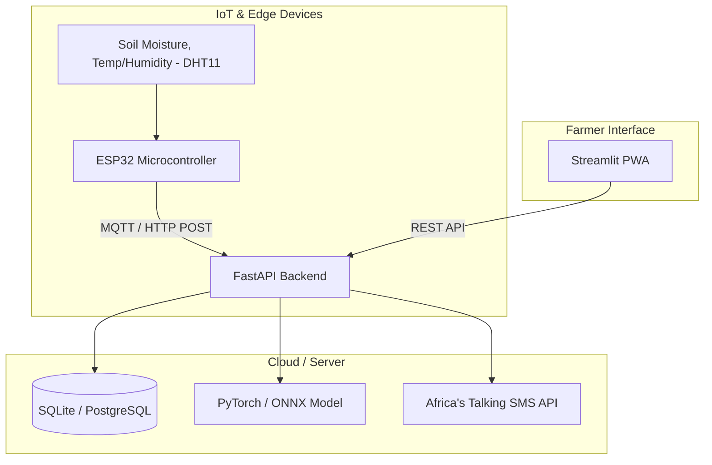

# AI Crop Disease Early Detection Assistant 🌱📱
### Hackathon Challenge #2: SDG 2 – Zero Hunger

This prototype provides an end-to-end AI + IoT system for early crop disease detection and stress prediction, tailored for African farmers.

---

## 🏗️ System Architecture



---

## 🛠️ Hardware Bill of Materials (BOM)
*Cheap local components (Estimated prices in Nairobi, Kenya)*
1. **ESP32 Development Board** (~KES 800)
2. **DHT11 Temperature & Humidity Sensor** (~KES 250)
3. **Capacitive Soil Moisture Sensor v1.2** (~KES 200)
4. Jumper Wires & Breadboard (~KES 300)

## 🚀 Features List
- **IoT Sensor Node:** MicroPython script (`esp32/`) reading DHT11 & soil moisture sensors.
- **AI Disease Detection:** PyTorch transfer learning model to detect crop diseases (e.g., Maize, Tomato) from phone images.
- **Environmental Stress Prediction:** Early warning alerts for drought/overwatering based on IoT data.
- **Farmer-Friendly Dashboard:** Streamlit PWA app with Swahili/English toggle, offline support (via browser Service Worker strategy).
- **SMS Alerts:** Integrated with Africa's Talking.

---

## 💻 Setup Instructions (Kenya Environment)

### 1. Prerequisites
- Python 3.11+
- Docker and Docker Compose
- Thonny IDE (for ESP32 flashing)

### 2. Quick Start with Docker
```bash
git clone <repo-url>
cd <repo-dir>

# Copy environment variables and insert Africa's Talking sandbox keys
cp .env.example .env

# Build and Run services
docker-compose up --build
```
- Frontend Streamlit App: `http://localhost:8501`
- Backend API Docs: `http://localhost:8000/docs`

### 3. ESP32 Setup
1. Flash your ESP32 with **MicroPython**.
2. Update `WIFI_SSID` and `WIFI_PASSWORD` in `esp32/main.py`.
3. Upload `boot.py`, `main.py`, and `umqttsimple.py` using Thonny.

---

## 🎬 Demo Video Script (2 Minutes)

**[0:00-0:15] Introduction:** 
"Hello! We are tackling Challenge #2 for Zero Hunger. This is our AI Crop Disease Early Detection Assistant, designed specifically for farmers in Africa."

**[0:15-0:45] IoT Hardware:** 
*(Show ESP32 and sensors)* "Here on the farm, this cheap KES 1200 ESP32 node continuously monitors soil moisture and temperature. It sends data even on weak 2G networks to our backend."

**[0:45-1:15] The App & AI:** 
*(Screen record Streamlit App)* "Our Streamlit PWA is built for offline-first usage. A farmer notices strange spots on a maize leaf, takes a picture, and our local AI model (running in < 2 seconds) diagnoses Northern Leaf Blight and suggests local treatments."

**[1:15-1:45] Predictive Alerts (Africa's Talking):** 
*(Show SMS notification on phone)* "But we go beyond symptoms. By analyzing the IoT data, our system predicts stress before it happens. Here's a live SMS alert sent via Africa's Talking: 'Onyo: Unyevu wa udongo uko chini. Tafadhali nyunyiza maji.' (Warning: Soil moisture is low. Please water.)"

**[1:45-2:00] Conclusion:** 
"A complete open-source solution, ready to deploy. Thank you!"
